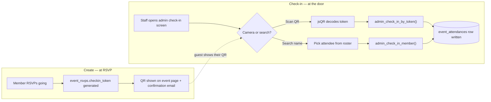

# SCOPE.md

## Re-scope note (2026-08-17)
Two things changed since the original scope below was written:
1. The QR now also ships in the RSVP confirmation email (was explicitly a non-goal, "site-only for now", reversed once we confirmed the confirmation email already sends regardless, so embedding it was near-zero marginal cost).
2. **D5, the shared per-event check-in code, is cut entirely**, not kept as a fallback. It never matched Luma's actual pattern (checked against their real docs: QR scan + staff manual name-search, no shared typed code), it predated this project's Luma research. QR is now the sole staff-facing check-in mechanism, with the pre-existing `admin_check_in_member` roster-search flow as the fallback, matching Luma exactly. Full reasoning in `docs/09-events-platform-plan.md` D13/§7.4/§7.5.

## The one thing
A member's confirmed RSVP renders a personal QR code (on the event page and in their confirmation email); staff scan it from the existing admin check-in screen to check them in. Manual roster search on that same screen is the fallback if a camera's unavailable.

## How it works

Two entry points into the door step because they solve different failure modes: QR is fast when a camera works, roster search is the fallback when it doesn't (dead phone, bad lighting, no signal). Both write to the same table through the same audit seam, so the roster and analytics never know or care which path a given check-in came through.

## Non-goals
- No new table or "ticket" object, reuses `event_rsvps.checkin_token` + `event_attendances` exactly as scoped in `docs/09-events-platform-plan.md` §7.5 (D12)
- No native scanner app, no offline/kiosk mode, browser camera scan from the existing admin check-in screen
- No wallet passes (Apple/Google Wallet)
- No staff permission tiering or multi-ticket handling, single ticket type per event assumed
- No new fallback UI, `admin_check_in_member`'s existing roster search already matches Luma's manual fallback pattern

## Done looks like
From `/admin/events/[id]/check-in`, staff can scan a guest's personal QR (or search their name manually) and see one of three outcomes: checked in, already checked in, or invalid. Writes `event_attendances` with `method='qr_token'` or `'admin_click'`. The old shared-code self-check-in flow no longer exists anywhere in the app, verified locally via `supabase db reset` + smoke tests, not just typecheck.
